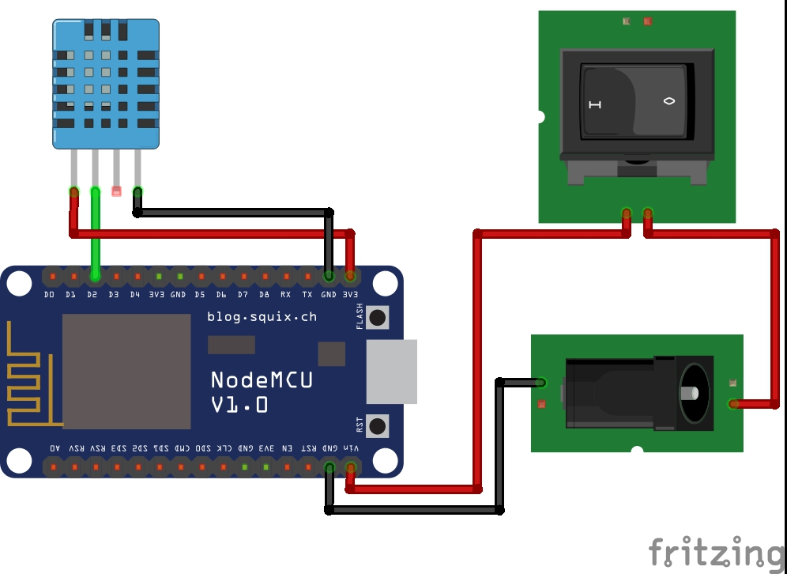

# Humidity Measurement System

The Humidity Measurement System provides a convenient and reliable solution for measuring and monitoring humidity levels in various indoor or outdoor settings. By utilizing the ESP8266 NodeMCU board, this project enables wireless communication, allowing users to access and view humidity data remotely.

## Table of Contents

- [Features](#features)
- [Usage](#usage)
- [Getting Started](#getting-started)
- [Components](#components)
- [Circuit](#circuit)
- [Contribution](#contribution)

## Features

- **Real-time humidity measurement**: The system continuously monitors and updates humidity levels, providing accurate and up-to-date information.
- **Wireless connectivity**: The ESP8266 NodeMCU board connects to a Wi-Fi network, enabling remote access to the humidity data through the Blynk cloud platform.
- **Blynk integration**: The project uses the Blynk IoT platform to visualize the humidity data and provide a user-friendly interface for monitoring.
- **Data logging**: The Blynk platform allows users to log and store historical humidity data, enabling trend analysis and data-driven decision-making.

## Usage

The biometric attendance system offers several uses and applications across various domains:

- **Residential Security**: Improve home security by allowing access only to authorized individuals, replacing traditional locks with a face recognition system.
- **Office and Workplace**: Control access to offices, sensitive areas, or restricted zones, ensuring that only authorized personnel can enter.
- **Institutions and Government Organizations**: Enhance security in educational institutions, research facilities, and government organizations by controlling access to restricted areas and data centers.
- **Smart Homes Integration**: Integrate the project with a smart home system to remotely monitor and control access to the property, providing convenience and peace of mind.

## Getting Started

1. Hardware setup:
	- Connect the DHT11 or DHT22 humidity sensor to the digital pin 4 of the ESP8266 NodeMCU board.
        - Make sure the necessary libraries (DHT.h, ESP8266WiFi.h, BlynkSimpleEsp8266.h, SPI.h) are installed in your Arduino IDE.

2. Blynk setup:
        - Install the Blynk mobile app on your smartphone or tablet.
        - Create a new Blynk account and project.
        - Obtain the authentication token for your project by going to Project Settings in the Blynk app.

3. Software setup:
        - Open the provided code in the Arduino IDE.
        - Modify the following variables in the code:
            - `auth`: Replace with your Blynk authentication token.
            - `ssid`: Enter your Wi-Fi network name (SSID).
            - `pass`: Enter your Wi-Fi network password.
        - Upload the code to the ESP8266 NodeMCU board.

4. Running the system:
        - Power on the ESP8266 NodeMCU board.
        - Launch the Blynk mobile app and open your project.
        - The system will start measuring humidity and sending the data to the Blynk cloud platform.
        - Use the Blynk app to monitor the real-time humidity readings and access historical data.

## Components

- 1 * ESP8266 NodeMCU
- 1 * DHT11 Humidity Sensor
- 2 * Switch
- 1 * Power Jack

## Circuit

Contributing

Contributions to this project are welcome. If you find any issues or have suggestions for improvement, please open an issue or submit a pull request on the project's GitHub repository.
